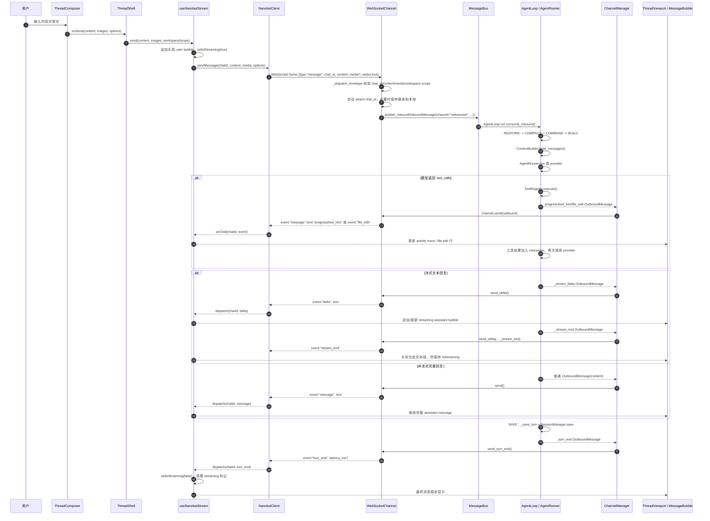

# WebUI 消息发送到回复显示流程

这份笔记追踪 WebUI 里“一条消息发送进来，到显示回复”的完整链路。它和 Agent 主链路的关系是：WebUI 负责浏览器端交互和 WebSocket 协议，后端 `WebSocketChannel` 把 WebUI 消息转成通用 `InboundMessage`，之后进入 `AgentLoop`；Agent 回复再通过 outbound bus 回到 `WebSocketChannel`，最终变成 WebSocket events 被前端渲染。

## 一句话主线

`ThreadComposer` 提交文本后，`useNanobotStream.send()` 先在前端追加一个乐观 user bubble，然后 `NanobotClient.sendMessage()` 发出 WebSocket `type: "message"` envelope。后端 `WebSocketChannel._dispatch_envelope()` 校验 chat、媒体和 workspace scope，调用 `_handle_message()` 发布 `InboundMessage(channel="websocket")` 到 bus。`AgentLoop` 处理模型和工具调用后发布 `OutboundMessage`，`ChannelManager` 分发给 `WebSocketChannel.send()`，它把回复转换成 `delta`、`message`、`stream_end`、`turn_end` 等 WebSocket event。前端 `NanobotClient.handleMessage()` 按 `chat_id` 分发给 `useNanobotStream`，hook 更新 `messages/isStreaming`，最后 `ThreadViewport/ThreadMessages/MessageBubble` 渲染到页面。

## 时序图



独立图文件在 `docs/webui_message_sequence.mmd`。

## 入口和关键文件

`webui/src/App.tsx`

负责 bootstrap。它调用 `fetchBootstrap()` 拿 token 和 ws 地址，用 `deriveWsUrl()` 拼 WebSocket URL，然后创建 `NanobotClient` 并 `client.connect()`。准备好后通过 `ClientProvider` 把 client/token 注入整棵 WebUI。

`webui/src/components/thread/ThreadShell.tsx`

线程页面的容器。它用 `useSessionHistory()` 加载历史，用 `useNanobotStream()` 订阅实时事件。`handleThreadSend()` 收到 composer 的提交后调用 `send()`。

`webui/src/components/thread/ThreadComposer.tsx`

输入框和附件控制。它不直接管 WebSocket，只负责收集用户输入、图片、slash/CLI/MCP mention、image generation 选项，然后触发 `onSend()`。

`webui/src/hooks/useNanobotStream.ts`

前端实时消息状态机。发送时追加乐观 user bubble、设置 loading；接收时处理 `delta`、`reasoning_delta`、`message`、`file_edit`、`stream_end`、`turn_end` 等事件，并维护 `messages`、`isStreaming`、activity trace 和 assistant streaming bubble。

`webui/src/lib/nanobot-client.ts`

WebSocket 多路复用客户端。一个 socket 承载多个 `chat_id`：`sendMessage()` 发 `type:"message"` envelope；`handleMessage()` 解析服务端事件；`dispatch()` 按 `chat_id` 分发给 `onChat()` 注册的 handler。

`webui/src/hooks/useSessions.ts`

历史加载旁路。切换会话时 `useSessionHistory()` 通过 `fetchWebuiThread()` 请求 `/api/sessions/{key}/webui-thread`，拿持久化 WebUI transcript。实时消息不走这个接口，而是走 WebSocket event。

`nanobot/channels/websocket.py`

后端 WebUI/WebSocket 网关。`_connection_loop()` 建立连接并发 `ready`；`_dispatch_envelope()` 处理 `new_chat`、`attach`、`message`；`_handle_message()` 最终调用 Channel 基类发布 inbound；`send()`、`send_delta()`、`send_turn_end()` 把 outbound 转成前端事件。

`nanobot/channels/manager.py`

后端 outbound 分发器。它消费 `MessageBus.outbound`，按 `msg.channel` 找到对应 channel，这里就是 `websocket`，然后调用 channel 的 `send()`。

`nanobot/agent/loop.py` 和 `nanobot/agent/runner.py`

Agent 主链路。WebUI 消息进入这里后，流程和其他渠道一样：session、context、provider、tools、save、respond。

## 事件怎么影响 UI

`event: "delta"`

一段流式 assistant 文本。`useNanobotStream` 会追加到当前 streaming assistant bubble；如果没有当前 bubble，就新建一个。

`event: "stream_end"`

当前文本段结束。注意：这不代表整轮完成。模型可能接下来还会执行工具，所以前端不会在这里把 `isStreaming` 设成 `false`。

`event: "message"`

完整消息或中间 trace。普通 assistant 回复会变成最终 assistant bubble；`kind: "tool_hint"` 或 `kind: "progress"` 会显示为 activity trace。

`event: "file_edit"`

文件编辑进度。前端会合并到 activity 区域的 file edit 行。

`event: "reasoning_delta"` / `event: "reasoning_end"`

模型 reasoning 流。前端显示在当前回答上方的 thinking/activity 区域。

`event: "turn_end"`

整轮 Agent 处理完成的权威信号。前端在这里停止 loading，清除 streaming 标记，记录 latency，并触发 `onTurnEnd()` 刷新侧边栏等状态。

## 调试建议

如果你要一步一步判断流程，先在浏览器 console 开启 WebSocket 日志：

```js
localStorage.setItem("nanobot_debug_ws", "1")
```

然后刷新 WebUI，发送一条消息，观察 `ready`、`attached`、`delta/message`、`stream_end`、`turn_end` 的顺序。

后端建议下断点或打日志的位置：

1. `webui/src/hooks/useNanobotStream.ts` 的 `send()`
2. `webui/src/lib/nanobot-client.ts` 的 `sendMessage()` 和 `handleMessage()`
3. `nanobot/channels/websocket.py` 的 `_dispatch_envelope()`
4. `nanobot/channels/websocket.py` 的 `_handle_message()`
5. `nanobot/agent/loop.py` 的 `_process_message()` / `_state_run()`
6. `nanobot/channels/websocket.py` 的 `send_delta()` / `send()` / `send_turn_end()`
7. `useNanobotStream.ts` 的事件 handler，尤其是 `delta`、`message`、`turn_end`

最值得追的变量是 `chat_id`。它贯穿：

```text
ThreadShell chatId
-> NanobotClient.sendMessage(chatId)
-> WebSocket envelope.chat_id
-> InboundMessage.chat_id
-> OutboundMessage.chat_id
-> WebSocket event.chat_id
-> NanobotClient.dispatch(chatId)
-> useNanobotStream messages
```
