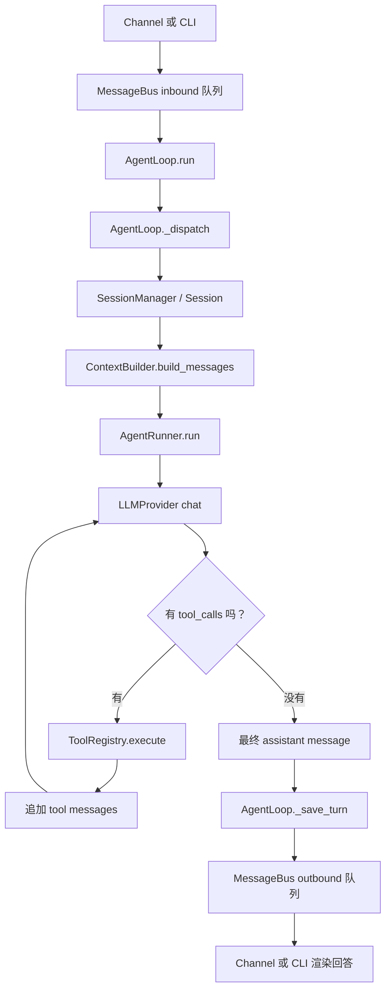

# Day 01：Agent 主链路

这份笔记追踪 Nanobot 从用户输入到最终回答的主流程。

## 5 分钟讲清楚

Nanobot 用 `MessageBus` 把聊天渠道和 Agent 核心解耦。Channel、CLI 或 SDK 会先把用户输入包装成 `InboundMessage`，再发布到 `MessageBus`。`AgentLoop.run()` 消费 inbound 队列里的消息，计算有效 session key，然后创建 `_dispatch()` 异步任务。`_dispatch()` 用 session lock 保证同一个会话串行处理，不同会话可以并发处理。

进入 `_process_message()` 后，一轮对话会经过一个小型状态机：

```text
RESTORE -> COMPACT -> COMMAND -> BUILD -> RUN -> SAVE -> RESPOND -> DONE
```

最重要的是 `BUILD -> RUN -> SAVE`。在 `BUILD` 阶段，`Session.get_history()` 取出合法的近期历史，`ContextBuilder.build_messages()` 生成 provider 可直接使用的 `messages`，`_persist_user_message_early()` 会提前保存本轮用户输入，避免中途失败导致用户消息丢失。在 `RUN` 阶段，`AgentLoop._run_agent_loop()` 处理产品层上下文，然后调用 `AgentRunner.run()`。`AgentRunner` 是可复用的 LLM 执行循环：调用 provider，检查 `LLMResponse.tool_calls`，通过 `ToolRegistry` 执行工具，把工具结果追加成 tool message，再次调用 provider，直到得到最终 assistant message 或遇到停止条件。在 `SAVE` 阶段，`_save_turn()` 把本轮新增的 assistant/tool 消息写回 session，`SessionManager.save()` 再把 JSONL 文件原子落盘。最后 `RESPOND` 组装 `OutboundMessage`，发布到 outbound 队列，由 Channel 或 CLI 渲染给用户。

## 主链路图



独立 Mermaid 图文件在 `docs/nanobot_main_flow.mmd`。

## Grep 追踪命令

这次源码追踪里比较有用的搜索命令：

```bash
rg -n "\b(Agent|run|messages|tool_calls|provider)\b" nanobot/agent nanobot/session tests/agent -S
rg -n "async def run|async def _dispatch|AgentRunSpec|runner.run|publish_outbound|publish_inbound" nanobot/agent/loop.py nanobot/bus nanobot/channels nanobot/cli nanobot/nanobot.py
rg -n "async def run|def _request_model|def _execute_tools|should_execute_tools|tools.execute|chat_with_retry|chat_stream_with_retry" nanobot/agent/runner.py
rg -n "class ToolRegistry|def get_definitions|async def execute" nanobot/agent/tools/registry.py
```

## 关键文件标记

1. `nanobot/bus/queue.py`
   作用：解耦渠道输入和 Agent 执行。`publish_inbound()` 把用户事件放入 inbound 队列；`publish_outbound()` 把 Agent 回复放入 outbound 队列。

2. `nanobot/channels/base.py`
   作用：通用 Channel 辅助逻辑。它把平台消息包装成 `InboundMessage`，再发布到 bus。具体渠道基本都围绕这个边界工作。

3. `nanobot/cli/commands.py`
   作用：CLI 入口。交互式命令行读取终端输入，发布带 `_wants_stream` 元数据的 `InboundMessage`，然后等待 outbound 完成。

4. `nanobot/agent/loop.py`
   作用：产品层主编排器。它管理 session、tools、模型运行时、progress callback、mid-turn injection、状态机、保存和 outbound 组装。

5. `nanobot/agent/context.py`
   作用：prompt 和 messages 组装器。它把 identity、`AGENTS.md` 等 bootstrap 文件、tool contract、memory、skills、近期历史、当前用户内容、媒体和运行时元数据组合起来。

6. `nanobot/session/manager.py`
   作用：session 持久化和回放。它加载/保存 JSONL session，通过 `get_history()` 选择模型可见历史，并处理时间戳、图片占位、合法 tool-call 边界和历史裁剪。

7. `nanobot/agent/runner.py`
   作用：核心模型/工具循环。它调用 provider，处理 streaming/non-streaming，执行 tool calls，追加 assistant/tool messages，处理空回复、长度截断、错误重试，并返回 `AgentRunResult`。

8. `nanobot/providers/base.py`
   作用：Provider 抽象契约。`LLMResponse` 和 `ToolCallRequest` 定义所有具体 provider 返回给 runner 的统一数据形态。

9. `nanobot/agent/tools/registry.py`
   作用：工具网关。它向 provider 暴露工具 schema，并在模型返回 tool calls 后负责参数校验、类型转换和真实工具执行。

10. `tests/agent/test_runner_core.py`
    作用：最适合先读的 runner 测试。它展示了“两次 provider 调用”的模式：第一次返回 tool calls，执行工具后，第二次带着 tool result 再请求模型，最后得到答案。

## 源码定位点

- `nanobot/agent/loop.py`：`TurnState` 和 `_TRANSITIONS` 定义一轮对话状态机。
- `nanobot/agent/loop.py`：`AgentLoop.run()` 消费 inbound bus 消息并创建 dispatch task。
- `nanobot/agent/loop.py`：`_dispatch()` 负责 session lock、streaming callback 和 outbound 发布。
- `nanobot/agent/loop.py`：`_state_build()` 加载历史并构造 `initial_messages`。
- `nanobot/agent/loop.py`：`_state_run()` 调用 `_run_agent_loop()`。
- `nanobot/agent/loop.py`：`_run_agent_loop()` 构造 `AgentRunSpec`，然后调用 `AgentRunner.run()`。
- `nanobot/agent/loop.py`：`_state_save()` 和 `_save_turn()` 持久化新消息。
- `nanobot/agent/runner.py`：`AgentRunner.run()` 是模型/工具迭代主循环。
- `nanobot/agent/runner.py`：`_request_model()` 决定调用 `chat_stream_with_retry()` 还是 `chat_with_retry()`。
- `nanobot/agent/runner.py`：`_execute_tools()` 和 `_run_tool()` 执行模型请求的工具。

## 应该怎么读这段源码

分四遍读。

1. 先看边界。先读 `MessageBus`、`InboundMessage`、`OutboundMessage`。这样你会先知道系统里流动的数据长什么样。

2. 再追一条 happy path。在 `loop.py` 里只看 `run()`、`_dispatch()`、`_process_message()`、`_state_build()`、`_state_run()`、`_state_save()`、`_state_respond()`。第一遍先跳过 compaction、checkpoint、subagent 等细节。

3. 然后打开 `runner.py`。重点追 `messages` 变量：模型请求、带 `tool_calls` 的 assistant message、tool result messages、第二次模型请求、最终 assistant message。

4. 用测试当可执行文档。先看 `tests/agent/test_runner_core.py`，再看 `tests/agent/test_loop_runner_integration.py`、`tests/agent/test_context_builder.py`、`tests/agent/test_loop_save_turn.py`。测试会告诉你维护者认为哪些行为必须稳定。

阅读时建议开两列笔记：一列写“数据形态”，一列写“谁负责”。例如：`messages` 由 `ContextBuilder` 构造，由 `AgentRunner` 治理和迭代，最后由 `AgentLoop._save_turn()` 持久化。把所有权搞清楚，就不容易被 async 和 helper 函数绕晕。
